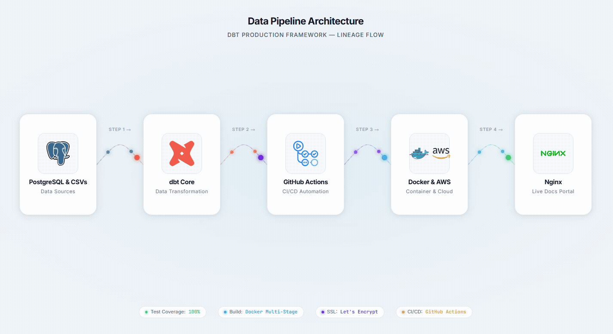

# ⚡ dbt-production-framework

> Enterprise analytics engineering pipeline running modular SQL transformations on PostgreSQL, validating data quality via GitHub Actions CI/CD gates, and delivering static lineage documentation through a hardened, containerized Nginx portal.

[](https://github.com/fran3ar/dbt-production-framework)
[](https://www.getdbt.com/)
[](https://www.postgresql.org/)
[](https://www.docker.com/)
[](https://nginx.org/)

---

<p align="center">
  
</p>

## 🏛️ Pipeline Architecture & Lineage

The warehouse processes raw transactional order events and tire catalog specifications into an analytical Star Schema following dimensional modeling best practices:

```text
       Raw Sources / Seeds
       ├── raw_products.csv
       └── raw_orders.csv
                │
                ▼  (dbt seed)
   ┌────────────────────────┐
   │     Staging Layer      │  Type casting, explicit column aliasing,
   │       (SQL Views)      │  deduplication, and null validations.
   ├────────────────────────┤
   │ • stg_products         │
   │ • stg_orders           │
   └────────────────────────┘
                │
                ▼  (dbt run)
   ┌────────────────────────┐
   │    Core Star Schema    │  Optimized dimensional analytical models
   │      (SQL Tables)      │  with precomputed unit margins and KPIs.
   ├────────────────────────┤
   │ • d_tire_product       │  Master dimension: product specs & baseline margin targets
   │ • f_sales_orders       │  Fact table: transactional revenue & realized gross margins
   └────────────────────────┘
                │
                ▼  (dbt docs generate)
   ┌────────────────────────┐
   │   Container Delivery   │  Compiled static lineage artifacts packaged into Alpine
   │  (Hardened Nginx:8082) │  and reverse-proxied via HTTPS subpath (`/dbt/`).
   └────────────────────────┘
```

## 📂 Project Structure

```text
dbt-production-framework/
│
├── .github/
│   └── workflows/
│       └── ci-cd.yml               # Automated test suites & zero-downtime EC2 deployment
│
├── dbt_project/                    # Root dbt project directory
│   ├── dbt_project.yml             # Global configurations, materialized models settings
│   ├── profiles.yml                # Dynamic DB profile resolving variables from runtime env
│   │
│   ├── models/
│   │   ├── overview.md             # Custom markdown documentation rendered on home page
│   │   │
│   │   ├── staging/                # Staging layer: source extraction and sanitization
│   │   │   ├── _staging_models.yml # Schema tests: uniqueness and not_null constraints
│   │   │   ├── stg_products.sql    # Cleaned products view with explicit numeric casts
│   │   │   └── stg_orders.sql      # Cleaned transactional orders view
│   │   │
│   │   └── warehouse/              # Warehouse layer: Dimensional Star Schema
│   │       ├── _warehouse_models.yml# Star schema tests and foreign key relationships
│   │       ├── d_tire_product.sql  # Dimension: product master enriched with unit targets
│   │       └── f_sales_orders.sql   # Fact: sales transactions joined with cost and margins
│   │
│   └── seeds/                      # Seed reference data
│       ├── raw_products.csv        # Baseline tire catalog dataset
│       └── raw_orders.csv          # Granular e-commerce sales records
│
├── Dockerfile                      # Production-ready multi-stage Alpine Nginx image
├── docker-compose.yml              # Local & remote container service orchestration
├── nginx.conf                      # Container web server configuration with cache control
├── requirements.txt                # Python runtime dependencies (dbt-core, dbt-postgres)
├── .dockerignore                   # Build exclusion rules
├── .gitignore                      # Git tracking ignore rules
└── README.md                       # Comprehensive architecture and operations manual
```

## 🔒 Security & Engineering Standards

- **Zero Hardcoded Credentials**: Database hosts, ports, users, and passwords strictly rely on dynamic environment variables injected at runtime via `.env` or GitHub Secrets.
- **BuildKit Secret Mounts**: Sensitive database credentials (`DB_USER`, `DB_PASSWORD`) are passed into Docker builds as transient build secrets (`--mount=type=secret`), preventing leakage in intermediate image layers or `docker history`.
- **Automated Data Quality Gates**: Every pipeline run enforces primary key uniqueness, non-null field constraints, and referential integrity relationships (`f_sales_orders.product_id` ➔ `d_tire_product.product_id`).
- **Clean Ingress Routing**: The internal web container operates on port `8082`, exposed to production traffic using an Nginx reverse proxy with SSL termination at `/dbt/`.

## ⚙️ CI/CD Deployment Workflow

The deployment pipeline is orchestrated using **GitHub Actions**:

1. **Test Gate**: Pull requests and commits to `main` trigger schema testing, unit checks, and model compilation.
2. **Build & Package**: Upon green build, documentation artifacts (`index.html`, `manifest.json`, `catalog.json`) are compiled and bundled into the Nginx container image.
3. **Automated Server Deployment**:
   - Connects to target EC2 server via dedicated deploy key (`EC2_SSH_KEY`).
   - Fetches latest commits and synchronizes without merge conflicts (`git fetch && git reset --hard origin/main`).
   - Rebuilds and launches the updated documentation container on port `8082`.

### Required GitHub Secrets

| Secret | Description |
|---|---|
| `EC2_HOST` | Production server public IPv4 address |
| `EC2_USER` | Deployment user (`ec2-user`) |
| `EC2_SSH_KEY` | Private SSH key for server access |
| `DB_HOST` | Warehouse database endpoint |
| `DB_PORT` | PostgreSQL port (`5432`) |
| `DB_NAME` | Analytics warehouse database name |
| `DB_USER` | Pipeline database user |
| `DB_PASSWORD` | Pipeline database password |
| `DB_SCHEMA` | Analytical target schema (`analytics`) |

## 📊 Data Modeling

The project follows a layered analytics engineering approach:

### Staging

Staging models provide a clean interface between raw seed data and downstream warehouse models. They handle:

- Explicit column naming and aliasing
- Data type casting
- Deduplication
- Basic null validation
- Source-level cleanup

### Warehouse

The warehouse layer implements a Star Schema:

**`d_tire_product`**

Product dimension containing tire catalog attributes, specifications, and baseline margin targets.

**`f_sales_orders`**

Transactional fact model containing sales order data, revenue, costs, quantities, and realized gross margins.

This structure separates descriptive attributes from transactional measures and provides a clean foundation for BI and analytical workloads.

## 🧪 Data Quality

Data quality is enforced through dbt schema tests and the CI/CD workflow.

Key validations include:

- Primary key uniqueness
- Required fields using `not_null`
- Referential integrity between fact and dimension models
- Successful model compilation
- Successful transformation execution

A deployment should only proceed after the data quality gates pass successfully.

## 🐳 Docker

The documentation portal is packaged as a production-oriented Nginx container.

The Docker build uses a multi-stage approach to keep the final runtime image lightweight and to avoid unnecessary build dependencies.

The resulting container serves generated dbt documentation on:

```text
http://localhost:8082
```

In production, the container is placed behind an external Nginx reverse proxy with SSL termination and exposed through:

```text
/dbt/
```

## 🔐 Environment Variables

Database configuration is resolved dynamically from environment variables.

Example:

```bash
DB_HOST=<postgres-host>
DB_PORT=5432
DB_NAME=<database-name>
DB_USER=<database-user>
DB_PASSWORD=<database-password>
DB_SCHEMA=analytics
```

Do not commit actual credentials to Git.

For local development, use an appropriate `.env` file or exported environment variables. For CI/CD, use GitHub Actions Secrets.

## 🛠️ Useful dbt Commands

Run from the `dbt_project` directory:

```bash
# Install dependencies
dbt deps --profiles-dir .

# Load seed data
dbt seed --profiles-dir .

# Build models
dbt run --profiles-dir .

# Run data quality tests
dbt test --profiles-dir .

# Generate documentation
dbt docs generate --profiles-dir .

# Run everything
dbt build --profiles-dir .

# Generate documentation and serve locally
dbt docs generate --profiles-dir .
dbt docs serve --profiles-dir .
```

## 📚 Documentation & Lineage

dbt documentation provides an interactive view of:

- Models
- Columns
- Tests
- Dependencies
- Source-to-model lineage
- Model-generated metadata

The generated documentation is packaged into the Nginx container and exposed through the production documentation portal.

## 🔄 Deployment Flow

```text
Developer
   │
   ▼
Git Push / Pull Request
   │
   ▼
GitHub Actions
   │
   ├── Install dependencies
   ├── Load seeds
   ├── Compile dbt project
   ├── Run dbt models
   ├── Run data quality tests
   ├── Generate dbt documentation
   │
   ▼
Docker Build
   │
   ▼
EC2 Deployment
   │
   ├── Fetch latest main
   ├── Reset working tree
   ├── Rebuild container
   └── Start Nginx documentation service
   │
   ▼
HTTPS Reverse Proxy
   │
   ▼
/dbt/ Documentation Portal
```

## 🎯 Engineering Goals

This project demonstrates production-oriented practices for analytics engineering:

- Modular dbt transformations
- PostgreSQL-based analytical modeling
- Dimensional Star Schema design
- Automated data quality validation
- GitHub Actions CI/CD
- Docker containerization
- Multi-stage image builds
- Nginx reverse proxy architecture
- HTTPS-enabled production delivery
- Dynamic credential management
- Automated EC2 deployment
- Interactive dbt lineage documentation

## 👤 Author

**Francisco Oviedo**

Data Engineer focused on analytics engineering, data pipelines, BI, cloud infrastructure, and automation.

GitHub: https://github.com/fran3ar

Portfolio: https://franciscooviedo.duckdns.org

---

## 📄 License

This project is intended as a portfolio and engineering demonstration project.
